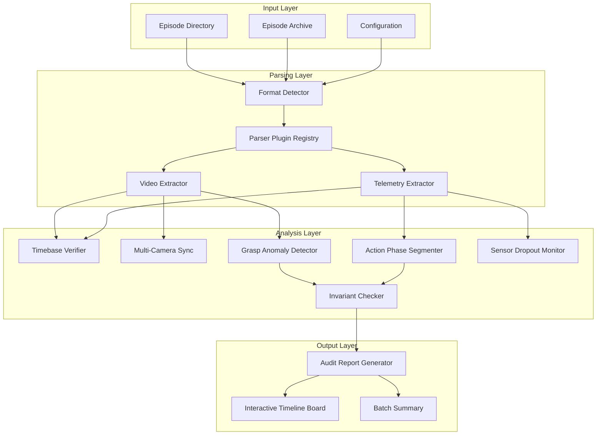

# Technical Design Document: RoboAudit Engine

## Overview

RoboAudit is a deterministic, format-agnostic data quality engine for robotics learning demonstrations. The system audits teleoperated demonstrations for operator mistakes, hardware faults, and logical contradictions through formal invariant checking and multi-modal sensor fusion.

### Design Goals

1. **Determinism**: All checks produce identical results given identical inputs (no ML models, no probabilistic thresholds)
2. **Format Agnostic**: Plugin architecture supports arbitrary recording formats through standardized extraction interfaces
3. **Testability**: All invariants are formally specified as universally quantified properties suitable for property-based testing
4. **Extensibility**: Kiro-native integration via custom agents and MCP servers

### Technology Stack

- **Runtime**: Python 3.11+
- **Video Processing**: PyAV (`av`) and `opencv-python` with integer PTS sampling
- **Telemetry Analysis**: `numpy` and `pandas` for time-series correlation
- **Property-Based Testing**: `hypothesis` for generative invariant testing
- **Visualization**: Lightweight Python HTTP server with HTML5/Canvas timeline

## Architecture

### System Architecture



### Component Interaction Flow

1. **Episode Ingestion**: Format detector identifies episode structure, selects appropriate parser plugin
2. **Data Extraction**: Parallel extraction of video frames (at integer PTS) and telemetry channels
3. **Deterministic Checks**: Independent analysis passes over extracted data
4. **Invariant Validation**: Formal consistency checks over aggregated results
5. **Report Generation**: Structured JSON output with optional interactive visualization

### Key Architectural Decisions

**Decision 1: Integer PTS Sampling**
- Rationale: Frame extraction at exact timestamps (1.0s intervals) ensures deterministic sampling across different video containers and codecs
- Trade-off: Sacrifices flexibility for reproducibility

**Decision 2: No ML Models**
- Rationale: All anomaly detection uses deterministic rules (thresholds, geometric constraints, logical invariants)
- Trade-off: Lower recall on subtle anomalies in exchange for zero false positives and perfect reproducibility

**Decision 3: Plugin-Based Parsers**
- Rationale: Recording formats vary by lab and robot platform; core engine remains format-agnostic
- Trade-off: Additional abstraction layer for maintenance of parser interface

**Decision 4: Separate Extraction and Analysis Phases**
- Rationale: Enables caching extracted data for iterative threshold tuning without re-parsing episodes
- Trade-off: Higher memory footprint during processing

## Components and Interfaces

### Episode Reader (`episode_reader.py`)

**Responsibilities:**
- Format detection and plugin selection
- Archive decompression (zip, tar, gzip)
- Delegation to format-specific parsers
- Metadata extraction

**Interface:**
```python
@dataclass
class EpisodeMetadata:
    episode_id: str
    duration_s: float
    recording_date: Optional[datetime]
    robot_type: str
    camera_count: int
    telemetry_channels: List[str]

@dataclass
class ExtractedEpisode:
    metadata: EpisodeMetadata
    video_streams: Dict[str, VideoStream]
    telemetry: pd.DataFrame
    
class EpisodeReader:
    def __init__(self, plugin_registry: ParserPluginRegistry):
        pass
    
    def read_episode(self, path: Path, config: AuditConfig) -> Result[ExtractedEpisode, str]:
        """Extract episode data from directory or archive."""
        pass
```

**Key Methods:**
- `detect_format(path: Path) -> Optional[str]`: Identify episode format from directory structure
- `extract_video_streams(path: Path) -> Dict[str, VideoStream]`: Extract timestamped frames at integer PTS
- `extract_telemetry(path: Path) -> pd.DataFrame`: Parse telemetry into synchronized DataFrame

### Parser Plugin Interface (`parser_plugin.py`)

**Responsibilities:**
- Define extension points for custom formats
- Provide standard extraction contracts
- Handle format-specific quirks

**Interface:**
```python
class ParserPlugin(ABC):
    @property
    @abstractmethod
    def format_name(self) -> str:
        """Human-readable format identifier."""
        pass
    
    @property
    @abstractmethod
    def priority(self) -> int:
        """Plugin selection priority (higher wins)."""
        pass
    
    @abstractmethod
    def matches_format(self, path: Path) -> bool:
        """Test if this plugin can parse the given path."""
        pass
    
    @abstractmethod
    def extract_videos(self, path: Path) -> Dict[str, List[Frame]]:
        """Extract timestamped frames from video files."""
        pass
    
    @abstractmethod
    def extract_telemetry(self, path: Path) -> pd.DataFrame:
        """Extract telemetry with timestamp column."""
        pass
    
    @abstractmethod
    def extract_metadata(self, path: Path) -> EpisodeMetadata:
        """Extract episode metadata."""
        pass

@dataclass
class Frame:
    timestamp_us: int  # Microsecond precision
    pts: int  # Presentation timestamp
    image: np.ndarray  # BGR format
    camera_id: str
```

### Timebase Verifier (`timebase.py`)

**Responsibilities:**
- Detect frame jitter and non-monotonic timestamps
- Detect telemetry sampling jitter
- Detect cross-modal desynchronization (video vs telemetry lag)

**Interface:**
```python
@dataclass
class TimebaseIssue:
    issue_type: Literal["frame_jitter", "telemetry_jitter", "non_monotonic", "sensor_desync"]
    severity: Literal["warning", "error"]
    time_range: Tuple[float, float]  # (start_s, end_s)
    affected_stream: str
    details: str

class TimebaseVerifier:
    def check_video_timebase(
        self, 
        frames: List[Frame], 
        expected_fps: float,
        jitter_threshold: float = 0.02
    ) -> List[TimebaseIssue]:
        """Detect frame timestamp jitter and non-monotonic sequences."""
        pass
    
    def check_telemetry_timebase(
        self,
        telemetry: pd.DataFrame,
        expected_rate_hz: float,
        jitter_threshold: float = 0.02
    ) -> List[TimebaseIssue]:
        """Detect telemetry sampling jitter."""
        pass
    
    def check_cross_modal_sync(
        self,
        video_timestamps: np.ndarray,
        telemetry_timestamps: np.ndarray,
        tolerance_ms: float = 50.0
    ) -> List[TimebaseIssue]:
        """Detect lag between video and telemetry streams."""
        pass
```

**Algorithms:**
- Frame jitter: `abs(delta_t - expected_interval) / expected_interval >= 0.02`
- Telemetry jitter: Same formula applied to consecutive telemetry samples
- Sensor desync: `abs(video_ts - nearest_telemetry_ts) > 50ms`

### Multi-Camera Sync Checker (`camera_sync.py`)

**Responsibilities:**
- Verify frame timestamp synchronization across cameras
- Detect camera stream swaps via feature consistency
- Validate frame count consistency

**Interface:**
```python
@dataclass
class CameraSyncIssue:
    issue_type: Literal["desync", "frame_count_mismatch", "camera_swap"]
    severity: Literal["warning", "error"]
    camera_pair: Tuple[str, str]
    time_range: Optional[Tuple[float, float]]
    details: str

class CameraSyncChecker:
    def check_timestamp_sync(
        self,
        camera_streams: Dict[str, List[Frame]],
        tolerance_ms: float = 16.0
    ) -> List[CameraSyncIssue]:
        """Verify frame timestamps stay synchronized across cameras."""
        pass
    
    def check_frame_counts(
        self,
        camera_streams: Dict[str, List[Frame]],
        tolerance_frames: int = 2
    ) -> List[CameraSyncIssue]:
        """Verify all cameras have similar frame counts."""
        pass
    
    def detect_camera_swap(
        self,
        camera_streams: Dict[str, List[Frame]]
    ) -> List[CameraSyncIssue]:
        """Detect camera identifier swaps via feature consistency."""
        pass
```

### Grasp Anomaly Detector (`grasp_anomaly.py`)

**Responsibilities:**
- Cross-reference gripper sensor state with visual evidence
- Detect object drops, phantom grasps, and sensor failures
- Annotate anomalies with camera evidence

**Interface:**
```python
@dataclass
class GraspAnomaly:
    anomaly_type: Literal["phantom_grasp", "missed_drop", "sensor_mismatch"]
    severity: Literal["low", "medium", "high"]
    timestamp_s: float
    gripper_state: str
    visual_evidence: List[str]  # Frame references
    details: str

class GraspAnomalyDetector:
    def detect_anomalies(
        self,
        telemetry: pd.DataFrame,
        video_streams: Dict[str, List[Frame]],
        config: AuditConfig
    ) -> List[GraspAnomaly]:
        """Detect contradictions between gripper sensors and visual evidence."""
        pass
    
    def measure_object_elevation(
        self,
        frames: List[Frame],
        gripper_bbox: Tuple[int, int, int, int]
    ) -> float:
        """Calculate object elevation delta using optical flow."""
        pass
```

**Detection Rules:**
- **Phantom Grasp**: `gripper_closed AND elevation_delta == 0` → High severity
- **Missed Drop**: `gripper_closed AND visual_object_falling` → High severity
- **Sensor Mismatch**: `gripper_force > 0 AND no_object_in_gripper_bbox` → Medium severity

### Action Phase Segmenter (`phase_segmenter.py`)

**Responsibilities:**
- Segment episode into temporal windows with action classifications
- Assign arm attribution (left, right, both, none)
- Classify contribution type (advancing, wasteful, idle)
- Calculate completion percentage for each window

**Interface:**
```python
@dataclass
class TemporalWindow:
    start_s: float
    end_s: float
    action_phase: Literal["approach", "grasp", "manipulate", "release", "idle"]
    arm_attribution: Literal["left", "right", "both", "none"]
    contribution_type: Literal["advancing", "wasteful", "idle"]
    completion_percentage: float  # 0.0 to 1.0
    
@dataclass
class Timeline:
    windows: List[TemporalWindow]
    
    def validate_monotonicity(self) -> bool:
        """Verify completion is non-decreasing during advancing phases."""
        pass

class ActionPhaseSegmenter:
    def segment_episode(
        self,
        telemetry: pd.DataFrame,
        video_streams: Dict[str, List[Frame]],
        config: AuditConfig
    ) -> Timeline:
        """Classify episode into temporal windows with action phases."""
        pass
    
    def classify_contribution(
        self,
        window: TemporalWindow,
        telemetry_slice: pd.DataFrame
    ) -> Literal["advancing", "wasteful", "idle"]:
        """Determine if window advances task, wastes time, or idles."""
        pass
    
    def calculate_completion(
        self,
        window: TemporalWindow,
        timeline_context: List[TemporalWindow]
    ) -> float:
        """Estimate task completion percentage for window."""
        pass
```

**Segmentation Heuristics:**
- **Approach**: Gripper open + end-effector velocity toward object
- **Grasp**: Gripper state transition open → closed
- **Manipulate**: Gripper closed + end-effector velocity > threshold
- **Release**: Gripper state transition closed → open
- **Idle**: Velocity < threshold for > 2.0s

### Invariant Checker (`invariant_checker.py`)

**Responsibilities:**
- Enforce logical consistency between timeline, outcome, and goal alignment
- Validate temporal ordering constraints
- Detect outcome mismatches

**Interface:**
```python
@dataclass
class InvariantViolation:
    invariant_name: str
    severity: Literal["error", "warning"]
    details: str
    affected_data: Dict[str, Any]

class InvariantChecker:
    def check_outcome_vs_completion(
        self,
        outcome: TaskOutcome,
        timeline: Timeline
    ) -> Optional[InvariantViolation]:
        """Verify outcome matches timeline completion."""
        pass
    
    def check_undone_timing(
        self,
        outcome: TaskOutcome
    ) -> Optional[InvariantViolation]:
        """Verify undone_at_s > goal_reached_at_s."""
        pass
    
    def check_progress_monotonicity(
        self,
        timeline: Timeline
    ) -> Optional[InvariantViolation]:
        """Verify completion never decreases during advancing phases."""
        pass
    
    def check_time_past_end(
        self,
        timeline: Timeline,
        episode_duration_s: float
    ) -> Optional[InvariantViolation]:
        """Verify all timestamps <= episode duration."""
        pass
    
    def check_idle_contribution_consistency(
        self,
        timeline: Timeline
    ) -> Optional[InvariantViolation]:
        """Verify idle windows have no completion increase."""
        pass
```

**Formal Invariants:**
1. **outcome_vs_alignment**: `(outcome == failure OR outcome == partial) → completion < 1.0`
2. **undone_timing**: `outcome == success_then_undone → undone_at_s > goal_reached_at_s`
3. **progress_vs_outcome**: `outcome == success → final_completion >= 0.95`
4. **progress_monotonicity**: `contribution == advancing → completion[i+1] >= completion[i]`
5. **time_past_end**: `∀ window: window.end_s <= episode_duration_s`

### Sensor Dropout Monitor (`sensor_monitor.py`)

**Responsibilities:**
- Detect telemetry gaps and frozen sensors
- Validate telemetry values against physical constraints
- Flag outliers and communication failures

**Interface:**
```python
@dataclass
class SensorIssue:
    issue_type: Literal["dropout", "freeze", "outlier"]
    severity: Literal["warning", "error"]
    channel: str
    time_range: Tuple[float, float]
    dropout_duration_s: Optional[float]
    details: str

class SensorDropoutMonitor:
    def detect_dropouts(
        self,
        telemetry: pd.DataFrame,
        gap_threshold_ms: float = 100.0
    ) -> List[SensorIssue]:
        """Detect gaps in telemetry channels."""
        pass
    
    def detect_frozen_sensors(
        self,
        telemetry: pd.DataFrame,
        motion_phases: List[TemporalWindow],
        freeze_threshold_s: float = 1.0
    ) -> List[SensorIssue]:
        """Detect constant values during motion phases."""
        pass
    
    def detect_outliers(
        self,
        telemetry: pd.DataFrame,
        joint_limits: Dict[str, Tuple[float, float]]
    ) -> List[SensorIssue]:
        """Detect values exceeding physical constraints."""
        pass
```

### Operator Mistake Classifier (`operator_mistakes.py`)

**Responsibilities:**
- Detect operator errors (drops, alignment struggles, hesitations, fumbles)
- Assign severity levels
- Annotate with camera evidence

**Interface:**
```python
@dataclass
class OperatorMistake:
    mistake_type: Literal["drop", "alignment_struggle", "hesitation", "fumble"]
    severity: Literal["low", "medium", "high"]
    timestamp_s: float
    duration_s: Optional[float]
    camera_evidence: List[str]
    details: str

class OperatorMistakeClassifier:
    def classify_mistakes(
        self,
        timeline: Timeline,
        telemetry: pd.DataFrame,
        video_streams: Dict[str, List[Frame]],
        anomalies: List[GraspAnomaly]
    ) -> List[OperatorMistake]:
        """Detect operator mistakes from timeline and sensor data."""
        pass
```

**Classification Rules:**
- **Drop**: Detected via grasp anomaly + visual evidence → High
- **Alignment Struggle**: Approach angle error > 15° for > 2.0s → Medium
- **Hesitation**: Idle phase > 2.0s during active task → Low
- **Fumble**: Trajectory oscillation > 3 reversals/s → Medium

### Audit Report Generator (`audit_report.py`)

**Responsibilities:**
- Aggregate analysis results into structured JSON report
- Validate report against schema
- Calculate quality scores
- Support markdown export

**Interface:**
```python
@dataclass
class AuditReport:
    schema_version: str
    context: EpisodeContext
    timeline: Timeline
    completion: TaskCompletion
    goal_alignment: GoalAlignment
    data_issues: List[DataIssue]
    operator_mistakes: List[OperatorMistake]
    quality_metrics: QualityMetrics
    
@dataclass
class QualityMetrics:
    total_anomalies: int
    critical_issues: int
    warning_count: int
    goal_alignment_score: float
    quality_score: float

class AuditReportGenerator:
    def generate_report(
        self,
        episode: ExtractedEpisode,
        timeline: Timeline,
        issues: List[DataIssue],
        mistakes: List[OperatorMistake],
        invariant_violations: List[InvariantViolation]
    ) -> AuditReport:
        """Assemble complete audit report."""
        pass
    
    def calculate_quality_score(
        self,
        report: AuditReport
    ) -> float:
        """Calculate aggregate quality score with weighted deductions."""
        pass
    
    def export_json(self, report: AuditReport) -> str:
        """Serialize report to JSON."""
        pass
    
    def export_markdown(self, report: AuditReport) -> str:
        """Format report as human-readable markdown."""
        pass
```

### Audit Parser (`audit_parser.py`)

**Responsibilities:**
- Parse JSON audit reports back into structured data
- Validate schema compliance
- Support round-trip verification

**Interface:**
```python
class AuditParser:
    def parse_report(self, json_str: str) -> Result[AuditReport, str]:
        """Parse JSON audit report into AuditReport object."""
        pass
    
    def validate_schema(self, report_dict: dict) -> Result[None, str]:
        """Validate report against schema version."""
        pass

class AuditPrettyPrinter:
    def format_report(self, report: AuditReport) -> str:
        """Format AuditReport back into valid JSON."""
        pass
```

### Interactive Timeline Board (`timeline_board.py`)

**Responsibilities:**
- Generate HTML5/Canvas visualization
- Serve interactive timeline via lightweight HTTP server
- Support playback, zooming, and anomaly inspection

**Interface:**
```python
class TimelineBoardGenerator:
    def generate_html(
        self,
        report: AuditReport,
        video_streams: Dict[str, List[Frame]]
    ) -> str:
        """Generate self-contained HTML file with embedded timeline visualization."""
        pass
    
    def serve_board(self, html_path: Path, port: int = 8080):
        """Serve interactive timeline board via HTTP server."""
        pass
```

**Visualization Features:**
- Multi-track layout: video thumbnails, telemetry plots, action phases, anomaly markers
- Color-coded contribution types (green=advancing, yellow=wasteful, gray=idle)
- Completion progress bar synchronized with timeline position
- Click-to-inspect anomaly details with frame references
- Playback controls (play/pause/seek/speed)
- Zoom and pan on temporal axis

### Batch Processor (`batch_processor.py`)

**Responsibilities:**
- Parallel processing of multiple episodes
- Aggregate summary generation
- Progress reporting

**Interface:**
```python
class BatchProcessor:
    def process_batch(
        self,
        episodes_dir: Path,
        config: AuditConfig,
        workers: int = 4
    ) -> BatchResult:
        """Process all episodes in directory with parallel workers."""
        pass
    
    def generate_summary(
        self,
        reports: List[AuditReport]
    ) -> BatchSummary:
        """Generate aggregate quality statistics."""
        pass
```

## Data Models

### Core Data Structures

```python
@dataclass
class EpisodeContext:
    dataset: str
    rig: str
    length_s: float
    instruction: str
    episode_id: str

@dataclass
class TaskCompletion:
    task_completed: bool
    goal_reached_at_s: Optional[float]
    undone_at_s: Optional[float]
    completed_at_s: Optional[float]
    reason: str

@dataclass
class GoalAlignment:
    matches_given: bool
    relation: str
    note: str

@dataclass
class DataIssue:
    issue: str
    category: Literal["timebase", "sensor", "camera", "grasp"]
    severity: Literal["low", "medium", "high", "error"]
    t_s: float
    evidence: List[str]

@dataclass
class TaskOutcome:
    outcome: Literal["success", "failure", "partial", "success_then_undone"]
    goal_reached_at_s: Optional[float]
    undone_at_s: Optional[float]
    completed_at_s: Optional[float]

@dataclass
class AuditConfig:
    jitter_threshold: float = 0.02  # 2.0%
    sensor_desync_tolerance_ms: float = 50.0
    camera_sync_tolerance_ms: float = 16.0
    sensor_gap_threshold_ms: float = 100.0
    hesitation_threshold_s: float = 2.0
    alignment_angle_threshold_deg: float = 15.0
    robot_type: str = "generic"
    joint_limits: Optional[Dict[str, Tuple[float, float]]] = None
```

### JSON Audit Report Schema

```json
{
  "schema_version": "1.0.0",
  "context": {
    "dataset": "string",
    "rig": "string",
    "length_s": "float",
    "instruction": "string",
    "episode_id": "string"
  },
  "timeline": [
    {
      "start_s": "float",
      "end_s": "float",
      "arm": "left | right | both | none",
      "action": "approach | grasp | manipulate | release | idle",
      "object": "string",
      "contribution": "advancing | wasteful | idle",
      "progress": "float [0.0-1.0]"
    }
  ],
  "completion": {
    "task_completed": "boolean",
    "goal_reached_at_s": "float | null",
    "undone_at_s": "float | null",
    "completed_at_s": "float | null",
    "reason": "string"
  },
  "goal_alignment": {
    "matches_given": "boolean",
    "relation": "string",
    "note": "string"
  },
  "data_issues": [
    {
      "issue": "string",
      "category": "timebase | sensor | camera | grasp",
      "severity": "low | medium | high | error",
      "t_s": "float",
      "evidence": ["string"]
    }
  ],
  "operator_mistakes": [
    {
      "type": "drop | alignment_struggle | hesitation | fumble",
      "severity": "low | medium | high",
      "t_s": "float",
      "evidence": ["string"]
    }
  ],
  "quality_metrics": {
    "total_anomalies": "int",
    "critical_issues": "int",
    "warning_count": "int",
    "goal_alignment_score": "float [0.0-1.0]",
    "quality_score": "float [0.0-1.0]"
  }
}
```

## Correctness Properties

*A property is a characteristic or behavior that should hold true across all valid executions of a system—essentially, a formal statement about what the system should do. Properties serve as the bridge between human-readable specifications and machine-verifiable correctness guarantees.*

Before writing the correctness properties, I need to analyze the acceptance criteria for testability using the prework tool.

### Property 1: Episode Extraction Completeness

*For any* episode directory containing video files and telemetry files, extracting the episode should produce all video streams and telemetry channels present in the directory.

**Validates: Requirements 1.1**

### Property 2: Archive Decompression and Extraction

*For any* episode archive in a supported format (zip, tar, compressed), decompressing and extracting should produce the same data as if the episode were provided as an uncompressed directory.

**Validates: Requirements 1.2**

### Property 3: Timestamp Precision Preservation

*For any* extracted video stream, all frame timestamps should maintain microsecond precision.

**Validates: Requirements 1.3**

### Property 4: Telemetry Sampling Rate Preservation

*For any* telemetry data extraction, the original sampling rate and synchronization markers should be preserved such that re-calculating the sampling rate from extracted data produces the original rate.

**Validates: Requirements 1.4**

### Property 5: Missing Component Error Reporting

*For any* episode directory missing required files (video or telemetry), the Episode_Reader should return an error message that specifically identifies which components are missing.

**Validates: Requirements 1.5**

### Property 6: Frame Jitter Detection

*For any* sequence of consecutive frame timestamps, when the variance from expected frame interval exceeds 2.0 percent, a timebase_jitter warning should be flagged with the correct frame range.

**Validates: Requirements 2.1**

### Property 7: Telemetry Jitter Detection

*For any* telemetry channel, when sampling jitter exceeds 2.0 percent, a timebase_jitter warning should be flagged with the correct time range.

**Validates: Requirements 2.2**

### Property 8: Non-Monotonic Timestamp Detection

*For any* frame or telemetry timestamp sequence, if timestamps are non-monotonic (decrease or equal when they should increase), a high-severity error should be flagged.

**Validates: Requirements 2.3**

### Property 9: Cross-Modal Desync Detection

*For any* episode with video and telemetry streams, when telemetry timestamps lag visual timestamps by more than 50 milliseconds, a sensor_desync warning should be flagged.

**Validates: Requirements 2.4**

### Property 10: Timebase Statistics Calculation

*For any* video stream or telemetry channel, the calculated mean interval and standard deviation should accurately reflect the timestamp distribution.

**Validates: Requirements 2.5, 2.6**

### Property 11: Phantom Grasp Detection

*For any* episode where gripper motor state is closed AND visual object elevation delta is zero, a grasp_anomaly with high severity should be recorded.

**Validates: Requirements 3.1**

### Property 12: Sensor-Visual Mismatch Detection

*For any* episode where gripper force sensor indicates contact AND visual evidence shows no object within gripper bounds, a grasp_anomaly with medium severity should be recorded.

**Validates: Requirements 3.2**

### Property 13: Object Drop Detection

*For any* episode where visual evidence shows object dropping AND gripper state remains closed, a grasp_anomaly with high severity should be recorded.

**Validates: Requirements 3.3**

### Property 14: Anomaly Evidence Completeness

*For all* grasp_anomaly detections, the anomaly record should include Camera_Evidence references with frame numbers.

**Validates: Requirements 3.4**

### Property 15: Temporal Window Classification Completeness

*For any* episode timeline, all temporal windows should have assigned values for Action_Phase, arm attribution, Contribution_Type, and Completion_Percentage in the range [0.0, 1.0].

**Validates: Requirements 4.1, 4.2, 4.3, 4.4**

### Property 16: Progress Monotonicity During Advancement

*For any* timeline, consecutive temporal windows with Contribution_Type "advancing" should maintain monotonically non-decreasing Completion_Percentage.

**Validates: Requirements 4.5**

### Property 17: Operator Hesitation Detection

*For any* Action_Phase that persists longer than 5.0 seconds without completion progress, an operator_hesitation warning should be flagged.

**Validates: Requirements 4.7**

### Property 18: Outcome-Completion Consistency

*For any* timeline where Task_Outcome is "failure" OR "partial", the final Completion_Percentage should be strictly less than 1.0.

**Validates: Requirements 5.1**

### Property 19: Undone Temporal Ordering

*For any* Task_Outcome of "success_then_undone", undone_at_s should strictly exceed goal_reached_at_s.

**Validates: Requirements 5.2**

### Property 20: Success Completion Threshold

*For any* Task_Outcome of "success", the final Completion_Percentage should be at least 0.95.

**Validates: Requirements 5.3**

### Property 21: Idle Window Completion Stasis

*For any* temporal window with Contribution_Type "idle", the Completion_Percentage should not increase within that window.

**Validates: Requirements 5.4**

### Property 22: Outcome Contradiction Detection

*For any* Task_Outcome that contradicts Timeline progression (violates invariants 18-21), an outcome_mismatch error with high severity should be reported.

**Validates: Requirements 5.5**

### Property 23: Drop Mistake Classification

*For any* episode where visual evidence shows an object dropping from the gripper, an operator_mistakes entry with type "drop" and high severity should be created.

**Validates: Requirements 6.1**

### Property 24: Alignment Struggle Detection

*For any* gripper approach where alignment error exceeds 15 degrees for more than 2.0 seconds, an operator_mistakes entry with type "alignment_struggle" and medium severity should be created.

**Validates: Requirements 6.2**

### Property 25: Hesitation Mistake Detection

*For any* Action_Phase that is "idle" for more than 2.0 seconds during task execution, an operator_mistakes entry with type "hesitation" and low severity should be created.

**Validates: Requirements 6.3**

### Property 26: Fumble Detection

*For any* arm trajectory exhibiting oscillation exceeding 3 reversals per second, an operator_mistakes entry with type "fumble" and medium severity should be created.

**Validates: Requirements 6.4**

### Property 27: Operator Mistake Metadata Completeness

*For all* operator_mistakes entries, the entry should include timestamp, severity, mistake type, and Camera_Evidence references.

**Validates: Requirements 6.5**

### Property 28: Audit Report Structure Completeness

*For any* successfully completed audit, the emitted JSON report should contain all required sections: timeline, completion, goal_alignment, data_issues, and operator_mistakes.

**Validates: Requirements 7.1, 7.2, 7.3, 7.4**

### Property 29: Error Report Generation

*For any* audit encountering unrecoverable errors, a partial audit report with an error section describing the failure should be emitted.

**Validates: Requirements 7.5**

### Property 30: Report Schema Validation

*For all* emitted JSON audit reports, the report should pass validation against the defined schema before being written to disk.

**Validates: Requirements 7.6**

### Property 31: Dual Format Export

*For any* AuditReport object, the engine should be able to export it in both JSON and markdown formats, with both formats containing equivalent information.

**Validates: Requirements 7.7**

### Property 32: Valid Report Parsing

*For any* valid JSON audit report, the Audit_Parser should successfully parse it into an AuditReport data structure without errors.

**Validates: Requirements 8.1**

### Property 33: Invalid Report Error Reporting

*For any* invalid JSON audit report, the Audit_Parser should return a descriptive error indicating the specific validation failure.

**Validates: Requirements 8.2**

### Property 34: Report Serialization Round-Trip

*For all* valid AuditReport objects, parsing then printing then parsing should produce an equivalent AuditReport object (structural equality).

**Validates: Requirements 8.4**

### Property 35: Required Field Validation

*For any* parsed audit report, the Audit_Parser should validate that all required fields are present according to the schema version, and reject reports missing required fields.

**Validates: Requirements 8.5**

### Property 36: Schema Version Validation

*For any* audit report with an unknown or unsupported schema version, the Audit_Parser should reject the report with a descriptive error.

**Validates: Requirements 8.6**

### Property 37: Timeline Board Generation

*For any* completed audit, an Interactive_Timeline_Board HTML file should be generated.

**Validates: Requirements 9.1**

### Property 38: Timeline Board Structure

*For any* generated Interactive_Timeline_Board HTML, the markup should contain elements for all required tracks: video streams, telemetry channels, action phases, and anomalies.

**Validates: Requirements 9.2**

### Property 39: Contribution Type Color Coding

*For any* timeline with temporal segments, the Interactive_Timeline_Board HTML should apply correct color coding based on Contribution_Type (advancing=green, wasteful=yellow, idle=gray).

**Validates: Requirements 9.5**

### Property 40: Progress Bar Rendering

*For any* timeline, the Interactive_Timeline_Board should include progress bar elements representing Completion_Percentage.

**Validates: Requirements 9.6**

### Property 41: Multi-Camera Timestamp Synchronization

*For any* episode with multiple camera streams, frame timestamps across cameras should remain synchronized within 16 milliseconds, or a camera_desync warning should be flagged.

**Validates: Requirements 10.1, 10.2**

### Property 42: Camera Frame Count Consistency

*For any* episode with multiple camera streams, when stream frame counts differ by more than 2 frames, a camera_desync warning should be flagged.

**Validates: Requirements 10.3**

### Property 43: Camera Swap Detection

*For any* episode where camera stream identifiers swap during recording, a camera_swap error with high severity should be flagged.

**Validates: Requirements 10.4, 10.5**

### Property 44: Sensor Dropout Detection

*For any* telemetry channel with gaps exceeding 100 milliseconds, a sensor_dropout warning should be flagged with the affected channel and time range.

**Validates: Requirements 11.1**

### Property 45: Sensor Freeze Detection

*For any* telemetry channel where values remain constant for more than 1.0 second during motion phases, a sensor_freeze warning should be flagged.

**Validates: Requirements 11.2**

### Property 46: Sensor Outlier Detection

*For any* telemetry values exceeding physically plausible ranges (joint limits, force sensor ranges), a sensor_outlier warning should be flagged with the affected samples.

**Validates: Requirements 11.3, 11.4**

### Property 47: Dropout Duration Calculation

*For all* sensor_dropout warnings, the warning should include the total duration and percentage of episode affected.

**Validates: Requirements 11.5**

### Property 48: Configuration Application

*For any* valid configuration file, the Audit_Engine should apply the specified jitter thresholds, timeout values, and severity mappings during processing.

**Validates: Requirements 12.1**

### Property 49: Invalid Configuration Error Reporting

*For any* invalid configuration file, the Audit_Engine should validate and report descriptive errors for invalid settings.

**Validates: Requirements 12.3**

### Property 50: Configuration Metadata Inclusion

*For any* audit report, the active configuration should be included in the report metadata section.

**Validates: Requirements 12.4**

### Property 51: Batch Processing Completeness

*For any* directory containing multiple episode subdirectories, the Audit_Engine should process all episodes and generate individual reports for each.

**Validates: Requirements 13.1, 13.3**

### Property 52: Parallel Processing Correctness

*For any* batch processing job with configurable worker thread count, all episodes should be processed correctly regardless of parallelism level.

**Validates: Requirements 13.2**

### Property 53: Batch Summary Generation

*For any* batch processing operation, an aggregate summary report with quality statistics across all episodes should be generated.

**Validates: Requirements 13.4**

### Property 54: Batch Error Resilience

*For any* batch processing operation where individual episodes fail, the engine should continue processing remaining episodes and report failures in the aggregate summary.

**Validates: Requirements 13.5**

### Property 55: Goal Alignment Score Range

*For any* processed episode, the calculated goal_alignment score should be in the range [0.0, 1.0].

**Validates: Requirements 14.1**

### Property 56: Goal Alignment Penalty Application

*For any* episode with wasteful segments, operator mistakes, or data anomalies, the goal_alignment score should be lower than an equivalent episode without such issues (weighted deductions applied).

**Validates: Requirements 14.2**

### Property 57: Failure Outcome Alignment Constraint

*For any* Task_Outcome of "failure", the goal_alignment score should not exceed 0.5.

**Validates: Requirements 14.5**

### Property 58: Plugin Registration and Selection

*For any* registered parser plugin and episode matching the plugin's format signature, the Episode_Reader should use that plugin for extraction.

**Validates: Requirements 15.1, 15.2**

### Property 59: Plugin Priority Resolution

*For any* episode where multiple parser plugins match, the Episode_Reader should use the plugin with the highest priority score.

**Validates: Requirements 15.4**

### Property 60: Plugin Failure Handling

*For any* parser plugin that fails during extraction, the Episode_Reader should gracefully handle the failure and report a descriptive error.

**Validates: Requirements 15.5**

## Error Handling

### Error Categories

1. **Parsing Errors**: Invalid episode formats, corrupted archives, missing required files
2. **Validation Errors**: Schema violations, invariant contradictions, malformed configurations
3. **Processing Errors**: Plugin failures, resource exhaustion, timeouts
4. **Logical Errors**: Outcome mismatches, temporal ordering violations

### Error Handling Strategy

**Fail-Fast for Critical Errors:**
- Corrupted or unreadable episode archives
- Invalid configuration files preventing engine initialization
- Schema version mismatches preventing parsing

**Graceful Degradation for Non-Critical Errors:**
- Single camera stream failures in multi-camera episodes (continue with remaining streams)
- Individual plugin failures (fallback to next available plugin)
- Partial telemetry channel dropouts (flag warnings, continue processing)

**Error Reporting Requirements:**
- All errors must include descriptive messages identifying the failure location and cause
- Partial audit reports must be generated for processing errors, capturing all successful analyses
- Batch processing must aggregate individual episode errors in summary reports

### Error Message Format

```python
@dataclass
class AuditError:
    error_code: str  # e.g., "PARSE_001", "INVARIANT_005"
    severity: Literal["warning", "error", "critical"]
    message: str
    context: Dict[str, Any]  # Episode ID, file paths, etc.
    timestamp: datetime
```

## Testing Strategy

### Dual Testing Approach

The RoboAudit engine will employ both **property-based testing** and **example-based unit testing** for comprehensive coverage:

**Property-Based Testing (Hypothesis):**
- All 60 correctness properties will be implemented as property-based tests
- Minimum 100 iterations per property test
- Each test tagged with format: `# Feature: roboaudit-engine, Property N: [property statement]`
- Focus on universal invariants, round-trip properties, and detection rules

**Example-Based Unit Testing:**
- Specific codec support verification (H264, H265, VP9, raw frames) - one example per codec
- Specific telemetry format support (CSV, JSON, Protocol Buffers, HDF5) - one example per format
- Interactive UI controls verification (timeline board playback, zoom/pan) - integration tests
- Robot-specific configuration profiles (UMI, Franka, Kinova) - one example per robot type
- Default configuration behavior - single test verifying defaults

**Integration Testing:**
- End-to-end episode processing with real robotics datasets
- Multi-camera synchronization with actual hardware recordings
- Interactive timeline board UI testing with browser automation
- Plugin architecture testing with multiple format parsers
- Batch processing with realistic dataset sizes

### Property Test Configuration

**Hypothesis Settings:**
```python
from hypothesis import given, settings, strategies as st

@settings(max_examples=100)
@given(episode=st.episodes(), config=st.audit_configs())
def test_property_N(episode, config):
    # Feature: roboaudit-engine, Property N: [property statement]
    ...
```

**Custom Strategies:**
- `st.episodes()`: Generate random episode structures with video/telemetry data
- `st.timelines()`: Generate random timeline sequences with action phases
- `st.audit_reports()`: Generate random audit report objects
- `st.temporal_windows()`: Generate random temporal windows with constraints
- `st.telemetry_streams()`: Generate random telemetry with controlled jitter/gaps

### Testing Priorities

**Critical Path (Must Test):**
1. Invariant checking (Properties 18-22) - correctness depends on these
2. Serialization round-trip (Property 34) - data integrity
3. Timebase verification (Properties 6-9) - core quality check
4. Report structure completeness (Property 28) - output validity

**High Value (Should Test):**
1. Anomaly detection (Properties 11-14, 23-26) - primary feature
2. Batch processing (Properties 51-54) - scalability
3. Configuration handling (Properties 48-50) - flexibility
4. Error handling (Properties 29, 33) - robustness

**Nice to Have (Regression Prevention):**
1. Metadata completeness (Properties 14, 27) - quality of life
2. Format support (example tests) - compatibility
3. UI rendering (Properties 37-40) - visualization

### Test Data Requirements

**Synthetic Data Generation:**
- Hypothesis strategies for all core data types
- Deterministic seeded generation for reproducibility
- Edge case coverage (empty episodes, single-frame videos, missing telemetry channels)

**Fixture Data:**
- Minimal real robotics episodes for integration testing
- One example per supported codec and telemetry format
- Multi-camera episodes with known desync patterns
- Episodes with annotated ground-truth mistakes and anomalies

### Continuous Verification

**Pre-commit Hooks:**
- Run property tests on modified modules (subset, fast feedback)
- Validate that all new invariants have corresponding property tests

**CI/CD Pipeline:**
- Full property test suite (all 60 properties, 100 iterations each)
- Integration tests with fixture data
- Performance benchmarks on standardized episodes

---

## Implementation Phases

### Phase 1: Core Infrastructure (Weeks 1-2)
- Episode reader with plugin architecture
- Basic video and telemetry extraction (PyAV, pandas)
- Configuration system with defaults
- Data model definitions

### Phase 2: Deterministic Checks (Weeks 3-4)
- Timebase verifier
- Multi-camera sync checker
- Sensor dropout monitor
- Property tests for Phase 1-2 components

### Phase 3: Analysis Components (Weeks 5-6)
- Grasp anomaly detector
- Action phase segmenter
- Operator mistake classifier
- Property tests for Phase 3 components

### Phase 4: Invariant System (Week 7)
- Invariant checker with all formal rules
- Audit report generator
- Audit parser and pretty-printer
- Round-trip property tests

### Phase 5: Visualization (Week 8)
- Interactive timeline board generator
- HTML5/Canvas rendering
- Lightweight HTTP server

### Phase 6: Batch Processing & Polish (Week 9)
- Batch processor with parallelism
- Aggregate summary generation
- Goal alignment scoring
- End-to-end integration tests

### Phase 7: Extensibility (Week 10)
- Parser plugin examples (standard format implementations)
- Kiro custom agent integration
- MCP server implementation
- Documentation and examples

---

## Kiro Integration

### Custom Agent Configuration

`.kiro/agents/robotics-auditor.json`:
```json
{
  "name": "Robotics Auditor",
  "description": "Audit robotics learning demonstrations for quality issues",
  "command": "python -m roboaudit.cli audit",
  "triggers": ["audit", "roboaudit"],
  "capabilities": [
    "episode_quality_analysis",
    "operator_mistake_detection",
    "timeline_visualization"
  ]
}
```

### MCP Server Interface

`roboaudit-mcp` server provides tools:
- `audit_episode`: Process single episode and return report
- `batch_audit`: Process multiple episodes in parallel
- `visualize_timeline`: Generate interactive timeline board
- `validate_report`: Parse and validate audit report JSON

### Integration Benefits

1. **Agent Workflow**: Kiro agents can invoke audits during dataset preparation pipelines
2. **Tool Interop**: MCP tools integrate with other robotics development workflows
3. **Spec Templates**: RoboAudit spec templates guide quality requirement definition
4. **Steering Files**: Workflow guides for robotics data quality best practices

---

## Dependencies

### Core Dependencies
- `python>=3.11`
- `av>=10.0.0` (PyAV for video processing)
- `opencv-python>=4.8.0` (computer vision)
- `numpy>=1.24.0` (numerical processing)
- `pandas>=2.0.0` (telemetry time-series)
- `hypothesis>=6.90.0` (property-based testing)

### Optional Dependencies
- `h5py>=3.9.0` (HDF5 telemetry support)
- `protobuf>=4.24.0` (Protocol Buffers support)
- `pytest>=7.4.0` (test runner)
- `pytest-xdist>=3.3.0` (parallel test execution)

---

## Future Enhancements

### Phase 2 Improvements (Post-Launch)

1. **ML-Assisted Anomaly Detection**: Optional ML models for grasp anomaly detection (opt-in, non-deterministic)
2. **Cloud-Based Batch Processing**: AWS Step Functions integration for large-scale dataset audits
3. **Real-Time Streaming Mode**: Live audit during teleoperation for immediate operator feedback
4. **Advanced Visualizations**: 3D robot pose overlay on timeline board
5. **Dataset Comparison**: Multi-episode quality trending and regression detection
6. **Auto-Remediation**: Automated suggestions for fixing common quality issues

### Community Extensions

1. **Parser Plugin Marketplace**: Community-contributed parsers for proprietary formats
2. **Custom Invariant Rules**: User-defined invariants via configuration DSL
3. **Quality Profiles**: Pre-configured audit profiles for common robot platforms
4. **Export Integrations**: Connectors for popular robotics datasets (RoboNet, RLDS, etc.)
